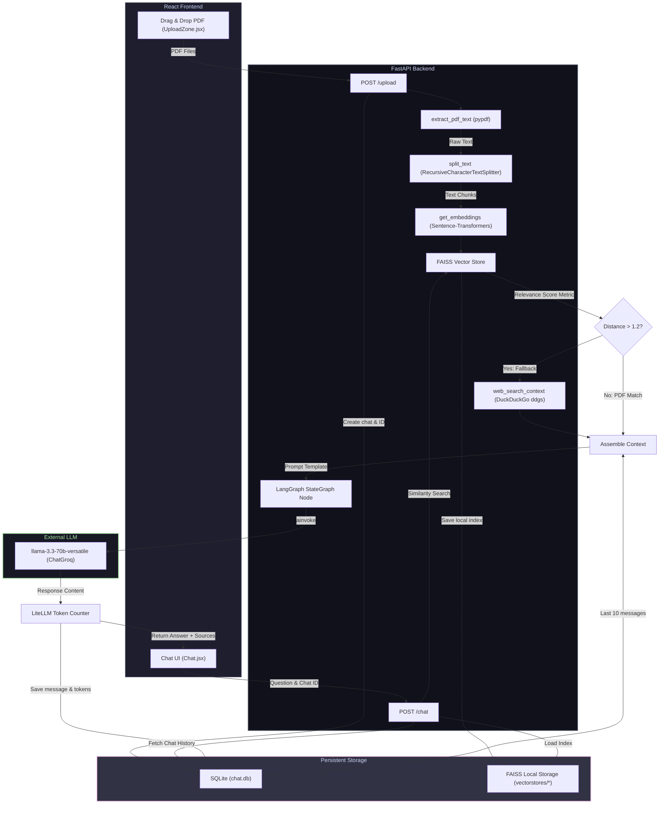

# 📄 PDF Chatbot (RAG & Web-Fallback Assistant)

Welcome to the **PDF Chatbot** codebase! This project is a full-stack Retrieval-Augmented Generation (RAG) application that allows users to upload PDF documents, extract and index their contents, and chat with them in real-time. 

Additionally, the system features a **dynamic web-fallback mechanism**: if a user's question cannot be answered closely by the PDF content (based on FAISS similarity search distance), it automatically queries DuckDuckGo for additional web context to provide accurate answers.

---

## 🏗️ Architecture Overview

The system operates on a client-server model consisting of a **React + Vite** frontend and a **FastAPI** backend powered by **LangChain**, **LangGraph**, and **SQLite**.

### System Data Flow Diagram



---

## 🛠️ Technology Stack

### Backend
- **Framework:** FastAPI (Python)
- **RAG & Agent Orchestration:** 
  - [LangGraph](https://github.com/langchain-ai/langgraph) (StateGraph workflow control)
  - [LangChain](https://github.com/langchain-ai/langchain) (Vectorstores, Embedding interfaces, ChatPromptTemplate)
- **Embeddings:** HuggingFace `sentence-transformers/all-MiniLM-L6-v2`
- **Vector Database:** FAISS (Local filesystem storage)
- **Language Model:** ChatGroq running `llama-3.3-70b-versatile`
- **Fallback Search:** DuckDuckGo Search API (`ddgs`)
- **Metadata/History Storage:** SQLite3 (Local `chat.db`)
- **Token Tracking:** LiteLLM token counter

### Frontend
- **Framework:** React 19 + Vite (Single Page Application)
- **Styling:** Tailwind CSS (v4)
- **File Upload:** React Dropzone
- **HTTP Client:** Native browser `fetch` API

---

## 📂 Project Directory Structure

Here is a guide to the repository files:

```markdown
PDF-Chatbot/
├── backend/
│   ├── main.py              # FastAPI endpoints, LangGraph orchestrator, and application entry point
│   ├── rag.py               # PDF text extraction, chunking, embedding, FAISS operations, and DuckDuckGo search
│   ├── database.py          # SQLite database connection setup and CRUD queries for chats & messages
│   ├── PromptTemplate.py    # Strict system instruction prompt template for the RAG LLM
│   ├── schemas.py           # Pydantic request models for input validation
│   ├── chat.db              # SQLite Database file storing conversation state (generated automatically)
│   └── vectorstores/        # Directory containing FAISS indexes serialized to disk (generated automatically)
│
├── frontend/
│   ├── src/
│   │   ├── App.jsx          # Top-level React container managing workspace state (chat history, active chat ID)
│   │   ├── App.css          # Core visual style styles override
│   │   ├── main.jsx         # React application entry point
│   │   ├── index.css        # Tailwind and base CSS configurations
│   │   └── components/
│   │       ├── Chat.jsx         # Primary chat workspace controller coordinating APIs, dropzones, and forms
│   │       ├── SideBar.jsx      # Navigation bar listing chat histories and providing deleting actions
│   │       ├── ChatHeader.jsx   # Top branding banner
│   │       ├── UploadZone.jsx   # Clickable drag-and-drop zone for PDF files
│   │       ├── PdfStatus.jsx    # Green status dot indicating a document is uploaded
│   │       ├── MessageList.jsx  # Scrollable scroll container housing messages and loaders
│   │       ├── MessageBubble.jsx# Context-colored chat bubbles displaying sources (PDF/Web) and tokens
│   │       └── InputArea.jsx    # Textarea field handling send buttons and Enter triggers
│   │
│   ├── package.json         # Node.js dependencies and scripts configurations
│   ├── vite.config.js       # Vite configuration file
│   └── eslint.config.js     # ESLint code syntax check config
│
└── .gitignore               # Ignored local files, databases, and dependencies
```

---

## 🔌 API Endpoints Reference

The FastAPI backend exposes the following REST API endpoints:

| Method | Endpoint | Description | Request Body / Parameters | Response Payload |
| :--- | :--- | :--- | :--- | :--- |
| `POST` | `/upload` | Receives PDF binary files, extracts text, chunks, computes embeddings, creates FAISS index, writes chat record to SQLite database. | Multipart form containing `files: list[UploadFile]` | `{ "chat_id": str, "title": str }` |
| `POST` | `/chat` | Runs similarity search over the document's vector store. If L2 distance > 1.2, fetches web search results, compiles prompt history, executes LLM node, saves chat message log. | Request_Format: `{ "chat_id": str, "question": str }` | `{ "answer": str, "sources": list[str], "token_count": int }` |
| `POST` | `/messages` | Retrieves all messages stored for a specific conversation ID. | Request_Messages: `{ "chat_id": str }` | `{ "messages": [ { "role": str, "content": str, "token_count": int } ] }` |
| `GET` | `/chats` | Retrieves all past chat sessions. | None | `{ "chats": [ { "chat_id": str, "title": str } ] }` |
| `DELETE`| `/delete` | Deletes chat logs, messages in SQLite, and cleans up the local FAISS index folder. | Request_Delete: `{ "chat_id": str }` | `{ "success": bool }` |

---

## 🧠 Core Component Walkthrough

### Backend Logic

1. **FastAPI & LangGraph Workflow ([main.py](file:///c:/Projects/Pdf-Chatbot/PDF-Chatbot/backend/main.py)):**
   - Implements a single-node `StateGraph` which invokes `ChatGroq(llama-3.3-70b-versatile)`.
   - The state includes `chat_id`, `context`, `question`, `answer`, and `token_count`.
   - Before compiling the prompt, `chat_node` loads the last 10 messages from the database to supply context to the LLM.

2. **RAG Services ([rag.py](file:///c:/Projects/Pdf-Chatbot/PDF-Chatbot/backend/rag.py)):**
   - **Text Extraction:** Uses `pypdf` to read bytes and combine page contents.
   - **Chunking:** `RecursiveCharacterTextSplitter` segments the text with a `chunk_size` of 500 characters and `chunk_overlap` of 100 characters.
   - **Embedding:** Maps text chunks to dense vectors using `sentence-transformers/all-MiniLM-L6-v2`.
   - **Vector Store:** Saves and loads a FAISS index on disk inside `vectorstores/{chat_id}`.
   - **Web Fallback:** Invokes DuckDuckGo text search to fetch the top 5 relevant web page descriptions if FAISS search L2 distance exceeds `1.2`.

3. **Storage & Models ([database.py](file:///c:/Projects/Pdf-Chatbot/PDF-Chatbot/backend/database.py) & [schemas.py](file:///c:/Projects/Pdf-Chatbot/PDF-Chatbot/backend/schemas.py)):**
   - Automatically initializes `chat.db` with schema schemas:
     - `chats`: `id` (UUID), `title` (Original PDF filename).
     - `messages`: `id` (Auto-increment), `chat_id`, `role` (user/assistant), `content`, `token_count`.

4. **System Instruction Prompt ([PromptTemplate.py](file:///c:/Projects/Pdf-Chatbot/PDF-Chatbot/backend/PromptTemplate.py)):**
   - Dictates strict constraints for LLM compliance:
     - Must only answer using the provided context.
     - Never invent facts or use external training knowledge.
     - Favor PDF content, fallback to Web context only when necessary.
     - Must output `"I cannot find that information in the provided sources."` if context is empty.

### Frontend Logic

1. **State Orchestration ([App.jsx](file:///c:/Projects/Pdf-Chatbot/PDF-Chatbot/frontend/src/App.jsx)):**
   - Serves as the central state hub. Shares chats, current chat ID, and active message history across components.

2. **SideBar Management ([SideBar.jsx](file:///c:/Projects/Pdf-Chatbot/PDF-Chatbot/frontend/src/components/SideBar.jsx)):**
   - Queries `GET /chats` on mount to display chat history lists.
   - Triggers message histories fetch on chat selection.
   - Handles the deletion flow.

3. **Main Dashboard ([Chat.jsx](file:///c:/Projects/Pdf-Chatbot/PDF-Chatbot/frontend/src/components/Chat.jsx)):**
   - Toggles dynamically: if `chatId` is null, displays the PDF `UploadZone`. If `chatId` is active, mounts the conversation panel (`MessageList`, `InputArea`).
   - Uses `react-dropzone` to handle PDF drops and initiates `POST /upload` requests.

---

## ⚡ Setup & Launch Instructions

### Backend Setup

> [!IMPORTANT]
> The backend requires a valid Groq API Key to power the chatbot. Make sure you have created a Groq account and obtained an API key.

1. Navigate to the backend directory:
   ```bash
   cd backend
   ```
2. Create and activate a Python virtual environment:
   ```bash
   python -m venv venv
   # On Windows (PowerShell):
   .\venv\Scripts\Activate.ps1
   # On macOS/Linux:
   source venv/bin/activate
   ```
3. Install required packages:
   ```bash
   pip install fastapi uvicorn pypdf langchain-text-splitters langchain-huggingface langchain-community faiss-cpu langchain-groq litellm duckduckgo-search python-dotenv
   ```
4. Create a `.env` file in the `backend/` directory:
   ```env
   GROQ_API_KEY=your_groq_api_key_here
   ```
5. Spin up the FastAPI server:
   ```bash
   uvicorn main:app --reload
   ```
   *The backend will boot up at `http://127.0.0.1:8000`.*

### Frontend Setup

1. Navigate to the frontend directory:
   ```bash
   cd ../frontend
   ```
2. Install node dependencies:
   ```bash
   npm install
   ```
3. Start the Vite React development server:
   ```bash
   npm run dev
   ```
   *The frontend application will compile and open at `http://localhost:5173`.*

---

## 💡 Key Design Patterns Used

- **Dual Context Retrieval (RAG & Web Fallback):** Combines localized similarity vector lookup with dynamic internet search, preventing hallucination while ensuring answers to outside-document questions remain grounded.
- **Stateless/Stateful hybrid Agent workflow:** LangGraph models the chatbot response generation as a controlled, single-node graph, allowing for easy expansion into multi-agent workflows (e.g. adding separate reviewer, web searcher, or document-synthesizer agents).
- **SQLite History Tracker:** Simple SQL queries save message histories by chat session UUIDs. This avoids session state management complexities and enables persistent session recall.
- **Glassmorphism UX Design:** The front-end relies on elegant dark UI features (zinc backgrounds, glasslike backdrop-blurs, glowing input borders, and responsive button scale micro-animations).

---

## 📝 Spaced Learning & Multi-Workspace Platform Notes (Temporary)

- **Isolated Workspace Architecture**: All 5 specialized chatbots reside in self-contained directories under `frontend/src/workspaces/` (`general/`, `contract-auditor/`, `spaced-learning/`, `spreadsheet-analytics/`, `interview-simulator/`). Each workspace manages its own dedicated sidebar, chat area, and right utility pane.
- **Database Partitioning**: SQLite chat logs and uploaded document records are partitioned via `workspace_type` filtering (`GET /chats?workspace_type=X`).
- **Multi-Format Text Ingestion**: Supports PDF (PyMuPDF with RapidOCR fallback for scanned pages), DOCX, PPTX, XLSX, CSV, TXT, and MD. Office formats are parsed using native, zero-dependency Python `zipfile` and `xml.etree.ElementTree`.
- **Concept Graph Node Deduplication**: Raw section titles undergo canonical subphrase normalization, Jaccard token overlap deduplication, and LLM-driven topic canonicalization to eliminate duplicate node clusters.
- **Session Mastery Progress & Daily Streak Counter**: Features an SVG circular progress ring rendering overall document mastery (`HIGH` = 100%, `MEDIUM` = 60%, `LOW` = 20%), an active queue counter, and a `🔥 3-Day Study Streak`.
- **Bi-Directional Mastery Synchronization**: Self-grading ratings (*Again* `#FF4C4C`, *Good* `#FFC107`, *Easy* `#3ECF8E`) immediately update canvas node dot colors in the 2D/3D Concept Graph.
- **Node Popover Grade Controls**: Selected concept nodes in `ConceptGraph3D.jsx` display direct grade buttons (`🔴 Again`, `🟡 Good`, `🟢 Easy`) to adjust node mastery directly from the graph view.

